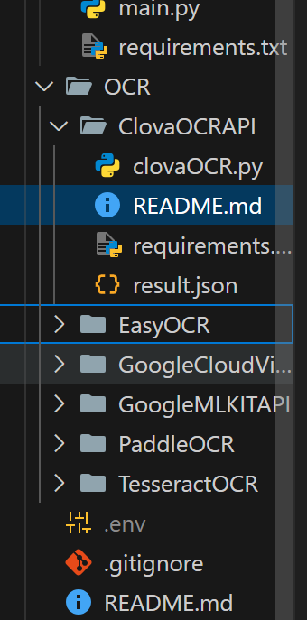

1. ClovaOCRAPI폴더로 터미널 경로를 이동한다. 
2. pip install requirements.txt로 패키지를 설치한다. 
3. 내가 말한 ClovaOCRAPI폴더 밖에 ..env 파일을 생성한다. 
4. 나한테 카톡으로 해당 파일 내용을 알려달라고 한다. 
5. ClovaOCRAPI폴더인지 체크하고 아니라면 이동한다. 그리고 python clovaOCR.py를 터미널 창에 입력하고 실행

